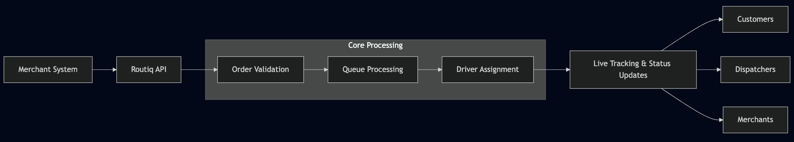

# 🚚 Routiq Backend API
**Multi-Tenant Delivery & Fleet Management Platform**  
*Because chaos is not a delivery strategy.*

---

## 👋 Hello There

Welcome to **Routiq** — a scalable, multi-tenant backend API built to run delivery and fleet operations without spreadsheets, guesswork, or 3 a.m. “where is the driver?” phone calls.

Routiq handles merchants, orders, drivers, fleets, real-time tracking, and all the logistical drama in between — calmly, efficiently, and at scale.

If you move things from point A to point B, **Routiq has your back**.

---

## ✨ What This Backend Actually Does

### 🏢 Multi-Tenant, Like a Grown-Up System
- Each delivery company lives in its own happy data bubble
- No accidental data leaks (we like our tenants isolated, thanks)
- One core system, many businesses

### 📦 Order Management (No Orders Left Behind)
- Centralised order intake from multiple merchants
- Smart validation, prioritisation, and lifecycle tracking
- Knows what an SLA is — and respects it

### 🚗 Drivers & Fleets, But Smarter
- Intelligent driver assignment
- Vehicle capacity awareness
- Real-time GPS updates (yes, *real* real-time)

### 📍 Live Tracking & Notifications
- Accurate ETAs
- Event-driven updates
- Less “Where is my order?” and more “Oh wow, that was fast.”

### 🔌 Merchant Integrations That Don’t Cry
- API-first, webhook-powered
- Plug into e-commerce, POS, or custom systems
- No polling. No hacks. No tears.

---

## 🧠 Under the Hood (Tech Stack)

- **Framework:** Laravel
- **Language:** PHP
- **Database:** MySQL / PostgreSQL (tenant-aware)
- **Cache & Realtime:** Redis
- **Queues:** Laravel Queues / Horizon
- **Auth:** Token-based (Sanctum / JWT)
- **Architecture:** Modular, API-first, microservice-ready

Built for scale. Built for sanity.

---

## 🏗️ High-Level Architecture (No Fancy Diagrams, Sorry)

Stateless where possible. Cached where necessary. Fast where it matters.

---

## 🧩 Core Modules

### 🔐 Authentication & Tenancy
- Tenant identification
- Role-based access control
- Secure API authentication

### 📦 Order Management
- Order creation & validation
- Status transitions
- Priority handling
- SLA awareness

### 🚗 Driver & Fleet Management
- Driver availability
- Vehicle assignment
- Capacity & workload tracking

### 🧠 Assignment Engine
- Location proximity
- Driver workload
- Delivery windows
- Dynamic re-assignment when life happens

### 📡 Tracking & Events
- Live GPS updates
- Webhooks for everyone
- Notification triggers

### 🚨 Exception Handling
- Delays
- Re-routing
- Driver unavailability
- Proactive customer alerts

---

## 🔄 Typical Delivery Flow (A Love Story)

1. **Order Received**  
   The system politely says: “Got it.”

2. **Order Validation**  
   Zones, capacity, and rules are checked (no funny business).

3. **Queue Processing**  
   Orders line up. No pushing.

4. **Driver Assignment**  
   The smartest driver gets the job.

5. **Live Tracking**  
   Everyone knows where everything is.

6. **Exception Handling**  
   Traffic happens. Routiq adapts.

---

## 📐 API Design Philosophy

- RESTful (because of course)
- Clear request & response contracts
- Predictable HTTP status codes
- Versioned endpoints (`/api/v1`)
- Webhooks > Polling (always)

---

## 🔗 Example Endpoints (Just a Teaser)

```http
POST   /api/v1/orders
GET    /api/v1/orders/{id}
PATCH  /api/v1/orders/{id}/status

POST   /api/v1/drivers
GET    /api/v1/drivers/available

POST   /api/v1/webhooks/merchant

```

## 👩‍💻 About Me

Hi, I’m **Rose R. Salim** 👋  
I design and build backend systems that make complex operations feel… manageable.

I work at the intersection of **engineering, documentation, and product strategy**, translating real-world business chaos into structured, scalable systems that teams can actually use and maintain.

My background spans:
- **Backend Engineering** — building reliable, multi-tenant systems with Laravel & .NET
- **Technical Writing** — turning complex architectures into clear documentation, APIs, and workflows
- **Technical Project Management** — aligning engineers, stakeholders, and business goals without the drama
- **Business Development** — designing systems that don’t just work, but make business sense

I care deeply about:
- Systems that scale without collapsing
- Documentation that developers don’t hate
- Clean APIs, clear logic, and thoughtful architecture
- Bridging the gap between “what the business wants” and “what the system should do”

If a system involves **logistics, workflows, automation, or multi-tenant platforms**, I’m probably already thinking about how to make it better.

Let’s build things that work — and keep working.
